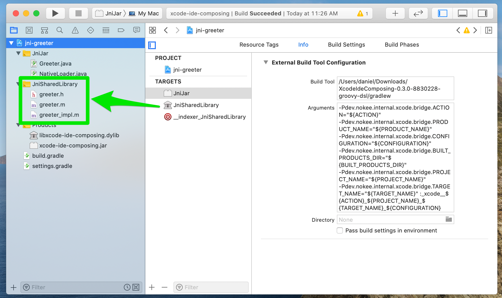
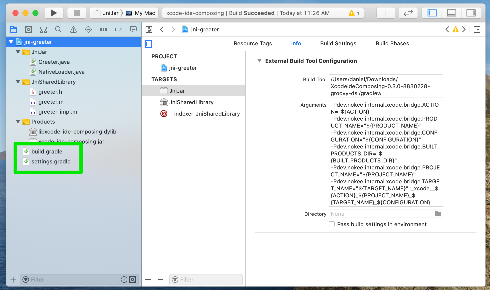
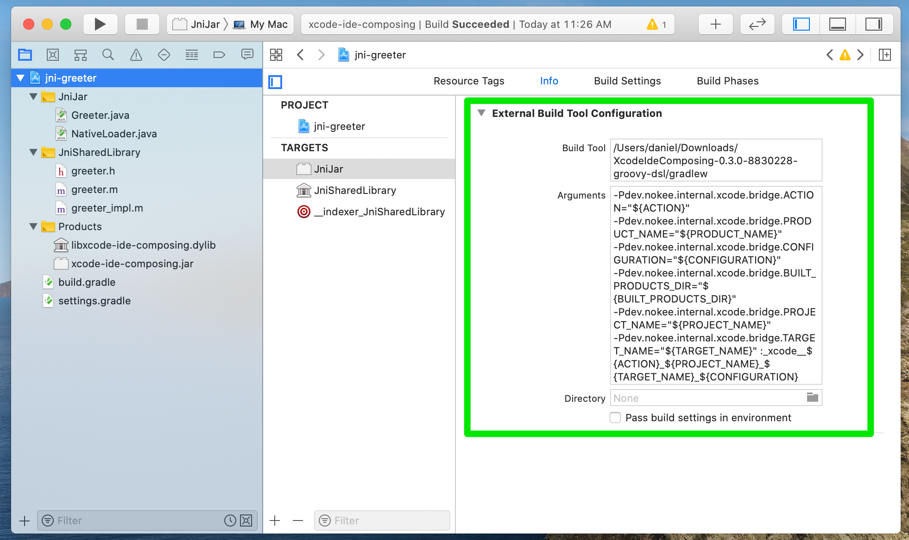
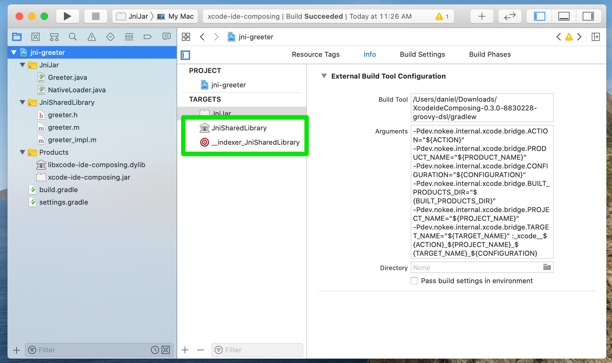
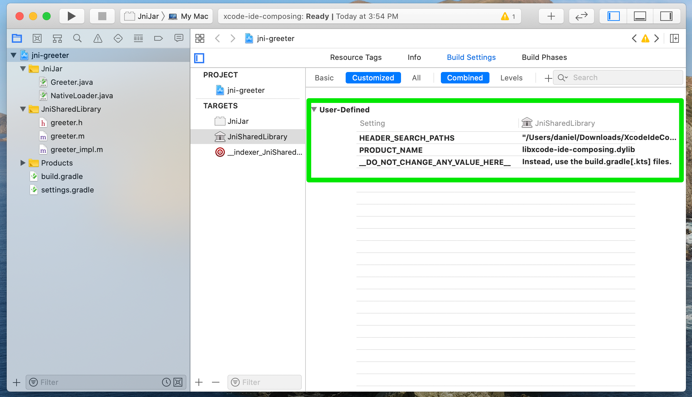
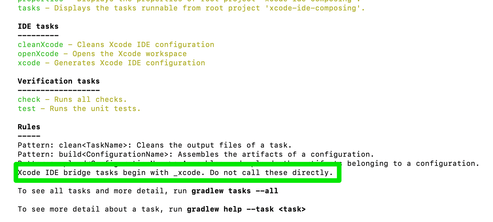
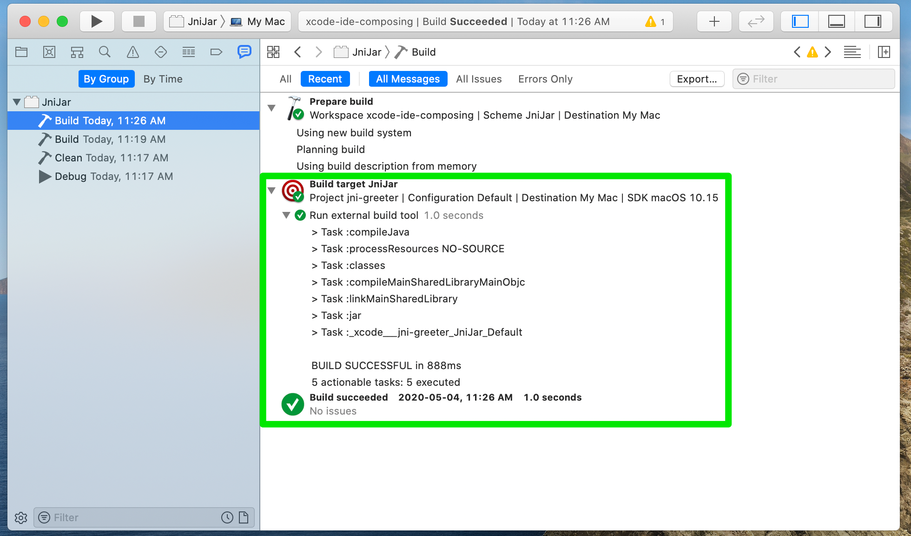

[[chapter:xcode-dev]]
= Developing with Xcode IDE
:jbake-type: manual_chapter
:jbake-tags: user manual, xcode, ide, gradle
:jbake-description: Learn the concept for integrating Xcode IDE with the Nokee plugins in Gradle.

Apple does not provide seamless integration with the Gradle build tool for its Xcode IDE.
The Nokee plugins provide the <<xcode-ide-plugin.adoc#, Xcode IDE Plugin>> for this purpose.
This chapter will discuss how Nokee integrates with the Xcode IDE.
See the <<xcode-ide-plugin.adoc#,plugin reference chapter>> for a more technical reference.

[[sec:xcode-dev-introduction]]
== Introduction

We will refer to Xcode as the Integrated Development Environment (IDE) for developing source code.
Every other aspect of Xcode is outside the scope of this chapter.
The plugin focuses heavily on keeping the developer experience within the IDE as close as possible to the _vanilla experience_ to ensure happiness among developers.
For example, executing tests from the sidebar, cmd+click navigation, searching symbols are all considered and work as expected.
We will discuss the background of the choices made by the plugin.

[[sec:xcode-dev-assumption]]
== Assumption made by the plugin

The Xcode IDE plugin assumes a unidirectional transfer of the build knowledge, from Gradle to Xcode.
In this case, Gradle is the single source of truth, and it convert only the required information into an Xcode-compatible model.
Whenever possible, the generated Xcode IDE will delegate to Gradle.
Gradle being the most flexible it allows for complex wiring of tasks and dependencies.

The developer must generate Xcode IDE files.
The files shouldn't be committed to source control.

NOTE: If your team or organization needs to submit the generated Xcode IDE files to source control, please link:https://github.com/nokeedev/gradle-native/issues/30[comment on this poll issue] with your use cases.

The plugin also assumes a single workspace per Gradle multi-project build.
Each Gradle project can contribute more than one Xcode project to the workspace if required.
For this reason, the plugin registers an extended extension on the root Gradle project to provide the additional capability for generating a workspace.

[[sec:xcode-dev-projects]]
== Xcode projects

By default, the Xcode IDE plugin considers a one-to-one mapping of the Gradle project to the Xcode project.
Despite this mapping, it is possible to register additional Xcode project via the link:../dsl/dev.nokee.ide.xcode.XcodeIdeProjectExtension.html#dev.nokee.ide.xcode.XcodeIdeProjectExtension:projects[container available on the extension].
The plugin includes the source code to the project matching a group named after the target it's associated.
The plugin disregards the on-disk layout of the sources when adding them to the project groups.

[[sec:xcode-dev-build-files]]
== Editing Gradle build files from the IDE

The Gradle build configuration is easily accessible from the IDE.
Despite Xcode having no support for Gradle file type, the Xcode IDE plugin includes them in the main group of the generated Xcode project as shown in the picture below.
The plugin also includes the `gradle.properties` files, if available, as well as any explicit initialization scripts passed on the command line.
It also considers changes to the setting and build file locations.

[[sec:xcode-dev-targets]]
== Xcode targets

The plugins consider a one-to-one mapping between the Gradle project components to Xcode targets.
Each target registered to an Xcode project will delegate to Gradle.
By default, the plugin infers the product type from the Gradle component type.
For ad-hoc Xcode projects, it is possible to choose product types that can be unknown to Xcode.
The external build target offers less constraint than native Xcode targets allowing better integration with Gradle.

NOTE: Head over to the <<sec:xcode-dev-appendix-how-xcode-delegate-to-gradle, appendix of this chapter to learn more how the plugin delegate to Gradle>>.

[[sec:xcode-dev-indexer]]
== Implicit Xcode indexer targets

Xcode IDE has a process to understand the sources to provide code assistance features such as syntax highlighting, code completion, and search for definitions and references.
The plugin will create an additional indexer target identified by the `\__indexer_` prefix for each product type it known as indexable.
Those targets are configured by the plugin to ensure the code is appropriately indexed.
In general, the plugin will source the indexer's build settings from the original target.
Some indexable product type requires special attention to play well with Xcode.
The plugin may have specialized logic to ensure the generated indexer target works with Xcode's indexer.
You should never use any of those targets while developing inside the Xcode IDE.

[[sec:xcode-dev-build-configurations]]
== Xcode build configurations

A build configuration is analogous to a build type in Gradle, typically known as Debug and Release variant.
When no build type is configured for a native component, the plugin creates a default build configuration named `Default`.
When a component does not build on the host machine due to missing toolchain, for example, the plugin creates a default build configuration named `Unbuildable` instead.

[[sec:xcode-dev-build-settings]]
== Xcode build settings

In a _vanilla Xcode experience_, developers would use the build settings to configure a particular aspect of a product's build process.
With the Xcode IDE plugin, developers configure the product's build process using the Gradle build language.
Modifying the build settings inside Xcode is discourage and is unlikely to have the desired effect.

[[sec:xcode-dev-appendix]]
== Appendix

[[sec:xcode-dev-appendix-how-xcode-delegate-to-gradle]]
=== How Nokee configure Xcode IDE to delegate to Gradle

The Xcode IDE plugin registers a bridging task rule that matches any tasks that starts with `\__xcode_`.
Only Xcode targets should be invoking those tasks directly.

The bridging task works in tandem with a set of properties used to transfer the requested Xcode IDE action to Gradle.
The plugin uses the project properties to search the Xcode project registry for the matching build configuration.
Once identified, the bridging task will copy the configured product location to the Xcode built product directory.
Thanks to the implicit task dependencies on the Provider API, the bridging task will automatically depend on the necessary tasks and execute the build as a typical command-line invocation would.
The command-line used when delegating to Gradle is also modified to include all explicitly defined initialization script.

When Xcode IDE requests a clean action, the bridging task will depend on the clean lifecycle task for the project.
