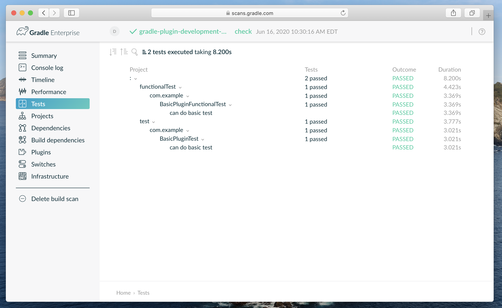

= Gradle Plugin Test Suites
:jbake-status: published
:jbake-summary: Unit and functional test Gradle plugins.
:jbake-type: sample_chapter
:jbake-tags: sample, gradle plugin development, gradle
:jbake-category: Gradle Plugin Development
:jbake-description: See how the Nokee team is helping the Gradle community develop better plugin by providing test suite Gradle plugins.
:jbake-permalink: gradle-plugin-development-with-test-suites
:jbake-archivebasename: GradlePluginDevelopmentWithTestSuites
:jbake-archiveversion: 1.6.8

NOTE: Open this sample in an IDE using https://www.jetbrains.com/help/idea/gradle.html#gradle_import_project_start[IntelliJ native importer], https://projects.eclipse.org/projects/tools.buildship[Eclipse Buildship].

Here is a sample to show how to unit and functional test a Gradle plugin.
The project is a simple Gradle plugin implemented in Java with a unit test using link:{gradle-api-reference}/org/gradle/testfixtures/ProjectBuilder.html[Gradle's `ProjectBuilder`] and a functional test using link:{gradle-user-manual}/test_kit.html[Gradle Test Kit].

====
[.multi-language-sample]
=====
.build.gradle
[source,groovy]
----
include::groovy-dsl/build.gradle[]
----
=====
[.multi-language-sample]
=====
.build.gradle.kts
[source,kotlin]
----
include::kotlin-dsl/build.gradle.kts[]
----
=====
====

To build and test the plugin:

[listing.terminal]
----
$ ./gradlew check

BUILD SUCCESSFUL
10 actionable tasks: 10 executed
----

Gradle executes both test suites, which is a unit test and a functional test, as expected.
The reports are available at their conventional location:

[listing.terminal]
----
$ ls ./build/reports/tests
functionalTest
test
----

The build scan displays the test events:

For more information, see Gradle Plugin Development <<../../manual/plugin-references.adoc#sec:plugin-reference-gradledev,reference chapters>> and <<../../manual/gradle-plugin-development.adoc#,user manual chapter>>.
