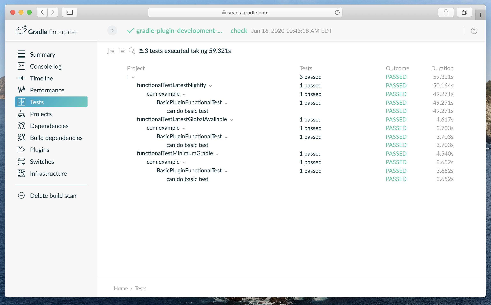
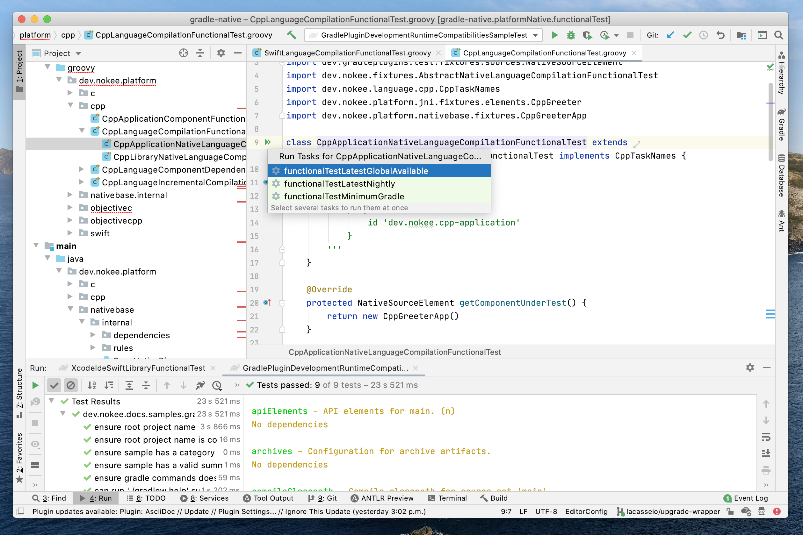

= Gradle Plugin Testing Strategies
:jbake-status: published
:jbake-summary: Test a Gradle plugin on multiple Gradle version.
:jbake-type: sample_chapter
:jbake-tags: sample, gradle plugin development, gradle
:jbake-category: Gradle Plugin Development
:jbake-description: See how the Nokee team is helping the Gradle community develop better plugin by providing testing strategies.
:jbake-permalink: gradle-plugin-development-with-testing-strategies
:jbake-archivebasename: GradlePluginDevelopmentWithTestingStrategies
:jbake-archiveversion: 1.6.8

NOTE: Open this sample in an IDE using https://www.jetbrains.com/help/idea/gradle.html#gradle_import_project_start[IntelliJ native importer], https://projects.eclipse.org/projects/tools.buildship[Eclipse Buildship].

Here is a sample to show how to expand the testing coverage of a Gradle plugin to multiple Gradle distributions.
The project is a simple Gradle plugin implemented in Java with a functional test using Gradle fixtures maintained by the Nokee team.

====
[.multi-language-sample]
=====
.build.gradle
[source,groovy]
----
include::groovy-dsl/build.gradle[]
----
=====
[.multi-language-sample]
=====
.build.gradle.kts
[source,kotlin]
----
include::kotlin-dsl/build.gradle.kts[]
----
=====
====
The Gradle executer will honour the selected testing strategy for the `Test` task.
Read the <<../../manual/gradle-plugin-development.adoc#sec:gradle-dev-testing-strategies,testing strategy section>> to learn more.

To build and test the plugin:

[listing.terminal]
----
$ ./gradlew check

BUILD SUCCESSFUL
9 actionable tasks: 9 executed
----

Gradle executes the test suites for all testing coverage, which is minimum supported Gradle, latest released Gradle and latest nightly.
The reports are available at their conventional location:

[listing.terminal]
----
$ ls ./build/reports/tests
functionalTestLatestGlobalAvailable
functionalTestLatestNightly
functionalTestMinimumGradle
----

The build scan displays the test events:

The developer can choose which coverage to execute directly from the IDE:

For more information, see Gradle Plugin Development <<../../manual/plugin-references.adoc#sec:plugin-reference-gradledev,reference chapters>> and <<../../manual/gradle-plugin-development.adoc#,user manual chapter>>.
