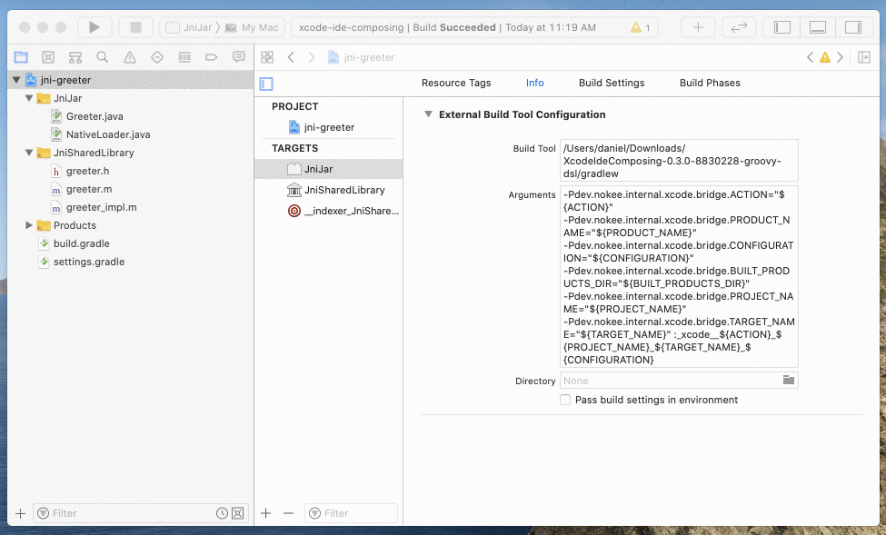
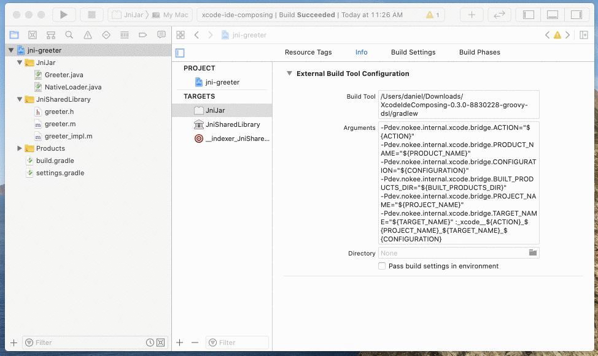

= Compose an Xcode IDE Project
:jbake-summary: Compose an Xcode IDE project for 3rd party plugins.
:jbake-type: sample_chapter
:jbake-tags: sample, jni, library, jvm, java, objective c, native, gradle, xcode, ide
:jbake-category: Integrated Development Environment (IDE)
:jbake-description: See how to use the Nokee Gradle plugins for composing an Xcode IDE project to keep a vanilla experience for the developers.

NOTE: You can open this sample inside an IDE using the https://www.jetbrains.com/help/idea/gradle.html#gradle_import_project_start[IntelliJ native importer] or https://projects.eclipse.org/projects/tools.buildship[Eclipse Buildship].

This sample shows how to use the Xcode IDE Plugin to create an Xcode project for 3rd party plugins.
In this sample, we show how to integrate a JNI library implemented in Java and Objective-C with Xcode.
The library has no dependencies, and the build has a minimal configuration.

====
[.multi-language-sample]
=====
.build.gradle
[source,groovy]
----
include::groovy-dsl/build.gradle[]
----
=====
[.multi-language-sample]
=====
.build.gradle.kts
[source,kotlin]
----
include::kotlin-dsl/build.gradle.kts[]
----
=====
====

To generate the Xcode workspace and project:

[listing.terminal]
----
$ ./gradlew xcode

> Task :xcode
Generated Xcode workspace at file://xcode-ide-composing.xcworkspace/

BUILD SUCCESSFUL
3 actionable tasks: 3 executed
----

We can validate from the command line the generated workspace is buildable by Xcode IDE using the `xcodebuild` tool:

[listing.terminal,only-if='macos']
----
$ xcodebuild -workspace xcode-ide-composing.xcworkspace -scheme JniJar
note: Using new build system
note: Planning build
note: Constructing build description
ExternalBuildToolExecution JniJar (in target 'JniJar' from project 'jni-greeter')
    cd ~
    ~/gradlew -Pdev.nokee.internal.xcode.bridge.ACTION= -Pdev.nokee.internal.xcode.bridge.PRODUCT_NAME=xcode-ide-composing.jar -Pdev.nokee.internal.xcode.bridge.CONFIGURATION=Default -Pdev.nokee.internal.xcode.bridge.BUILT_PRODUCTS_DIR=/Users/daniel/Library/Developer/Xcode/DerivedData/xcode-ide-composing/Build/Products/Default -Pdev.nokee.internal.xcode.bridge.PROJECT_NAME=jni-greeter -Pdev.nokee.internal.xcode.bridge.TARGET_NAME=JniJar --init-script ~/.gradle/repo.init.gradle --init-script ~/.gradle/init.gradle :_xcode___jni-greeter_JniJar_Default
> Task :compileJava
> Task :processResources NO-SOURCE
> Task :classes
> Task :compileMainSharedLibraryMainObjc
> Task :linkMainSharedLibrary
> Task :jar
> Task :_xcode___jni-greeter_JniJar_Default

BUILD SUCCESSFUL
5 actionable tasks: 5 executed

** BUILD SUCCEEDED **
----

We can open the workspace through Gradle using the `openXcode` task.
From Xcode, we can perform a build which delegates to Gradle:

We can also navigate to symbols:

For more information, see <<../../manual/xcode-ide-plugin.adoc#,Xcode IDE Plugin>> and <<../../manual/developing-with-xcode-ide.adoc#,Developing with Xcode IDE>> chapters.
